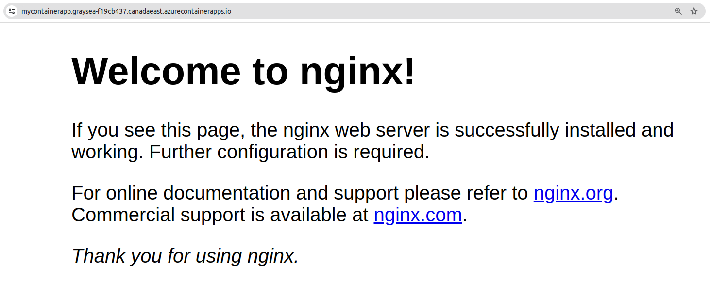

# App Bicep Azure

Deploy a serverless application (NGINX container) with Bicep on Azure.

> :information_source: Bicep is an IaC tool which concept is similar to Terraform but designed for Azure.

## Setting up Azure CLI

1. Install pre-requisites (Azure CLI)

    <details>
    <summary>🐧 Procedure for Linux</summary>

    ```bash
    sudo apt-get update
    sudo apt-get install ca-certificates curl apt-transport-https lsb-release gnupg

    sudo mkdir -p /etc/apt/keyrings
    curl -sLS https://packages.microsoft.com/keys/microsoft.asc | gpg --dearmor | sudo tee /etc/apt/keyrings/microsoft.gpg > /dev/null
    sudo chmod go+r /etc/apt/keyrings/microsoft.gpg

    AZ_DIST=$(lsb_release -cs)
    echo "deb [arch=`dpkg --print-architecture` signed-by=/etc/apt/keyrings/microsoft.gpg] https://packages.microsoft.com/repos/azure-cli/ $AZ_DIST main" |
        sudo tee /etc/apt/sources.list.d/azure-cli.list

    sudo apt-get update
    sudo apt-get install azure-cli
    ```

    </details>

    <details>
    <summary>🪟 Procedure for Windows</summary>

    a. Install Powershell 7
   
    ```powershell
    winget install --id Microsoft.Powershell --source winget
    ```

    b. Open a Powershell 7 window and install the Azure CLI
   
    ```powershell
    Install-Module Az
    ```

    </details>

2. Login to Azure

    <details>
    <summary>🐧 Procedure for Linux</summary>

    ```bash
    az login
    ```

    Follow interactive instructions.

    </details>

    <details>
    <summary>🪟 Procedure for Windows</summary>

    ```powershell
    Connect-AzAccount
    ```

    Follow interactive instructions.

    </details>

3. Change in-use subscription ID

    <details>
    <summary>🐧 Procedure for Linux</summary>

    ```bash
    az account list
    az account set --subscription 1635e3ad-xxxx-45c7-9a41-b7004f634867
    ```

    </details>

    <details>
    <summary>🪟 Procedure for Windows</summary>

    ```powershell
    Get-AzSubscription
    Set-AzContext -Subscription "1635e3ad-xxxx-45c7-9a41-b7004f634867"
    ```

    </details>

## Deploying resources

1. Deployment

    <details>
    <summary>🐧 Procedure for Linux</summary>

    Deploy resources running the following command :

    ```bash
    az deployment sub create --name demobicep --location canadaeast --template-file main.bicep --parameters resourceGroupName=rg-bicep resourceGroupLocation=canadaeast
    ```

    If you want to process the successful output, use [jq](https://manpages.ubuntu.com/manpages/xenial/man1/jq.1.html) :

    ```bash
    az deployment sub create --name demobicep --location canadaeast --template-file main.bicep --parameters resourceGroupName=rg-bicep resourceGroupLocation=canadaeast | jq '.properties.outputs.containerAppFQDN.value'
    ```

    </details>

    <details>
    <summary>🪟 Procedure for Windows</summary>

    ```powershell
    New-AzSubscriptionDeployment -Name demobicep -Location canadaeast -TemplateFile main.bicep -resourceGroupName rg-bicep -resourceGroupLocation canadaeast
    ```

    </details>

    There you have it ! 

2. Destroying resources

    <details>
    <summary>🐧 Procedure for Linux</summary>

    ```bash
    az group delete -g rg-bicep --yes
    ```

    </details>

    <details>
    <summary>🪟 Procedure for Windows</summary>

    ```powershell
    Remove-AzResourceGroup -Name rg-bicep
    ```

    </details>

    :boom:
